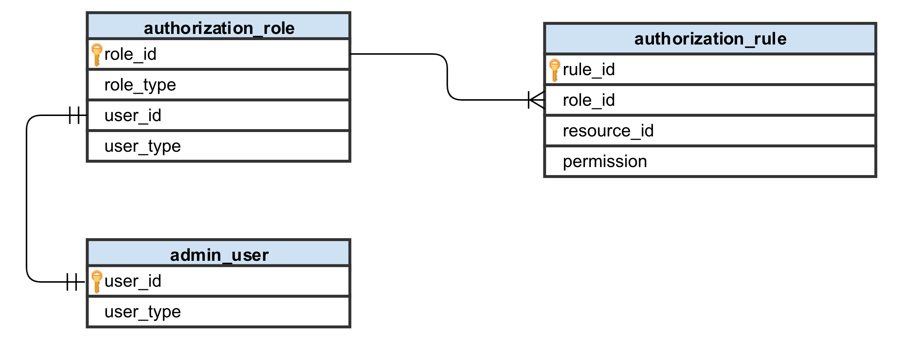
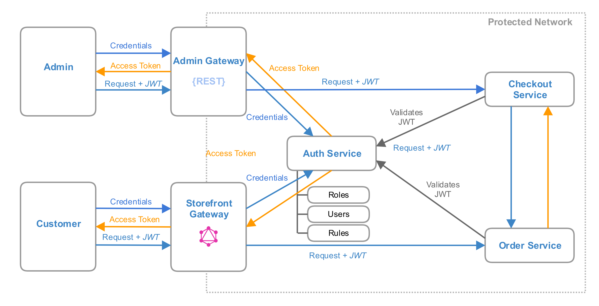
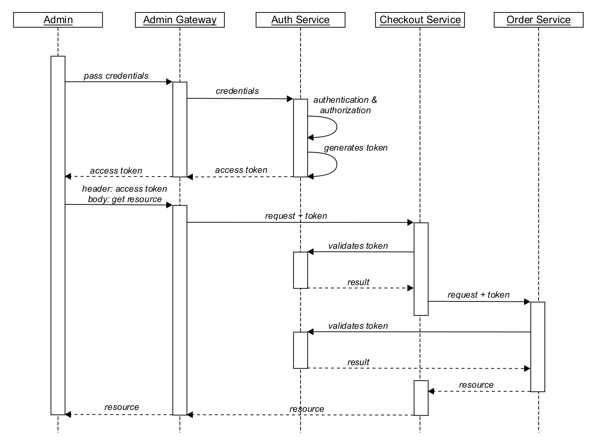
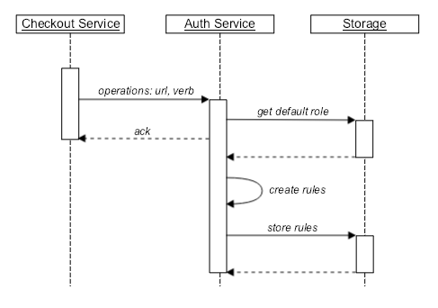
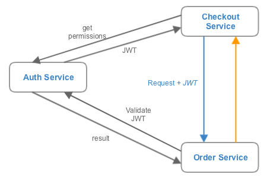

# Authentication and Authorization

## Overview

One of the important things that how a service knows which request is allowed to proceed and what type of data should be
available for the request initiator. In other words, Magento should provide entry points which allow making
authentication and authorization for different roles and users. Storefront Gateway should provide authentication for
customers, Admin Gateway for users with admin privileges.

There are few multiple strategies how to build authentication and authorization for services:
    
1. BFF/Monolith performs authentication and authorization 
     - Pros: a single entry point for permissions validation, no code duplication
     - Cons: services should trust BFF/monolith
2. A service performs authentication and authorization
     - Pros: services control all the flow of roles and privileges
     - Cons: the same logic is duplicated in multiple services
3. BFF/Monolith performs authentication, a service performs authorization
    - Pros: single entry point for authentication, services control roles & privileges
    - Cons: shared roles & privileges data between services
4. BFF/Monolith performs authentication and authorization, a service uses a "secure" token
    - Pros: a single entry point for credentials and permissions validation, more secure communication, avoids
[Confused Deputy Problem](https://en.wikipedia.org/wiki/Confused_deputy_problem)
    - Cons: additional logic to validate a "secure" token (could be extracted to a separate service)

According to described above strategies, the last approach looks like more convenient. It allows building authentication
& authorization flow with a single source of roles & privileges and provides additional secure communication for separate
services.

### Token-based Auth

Token-based auth allows users to use credentials like username and password to obtain a token which allows communicating
with the system without using credentials.
As Monolith/BFF performs authentication & authorization token-based auth allows using tokens for a secure communication
between a user, Monolith/BFF, and services.

[JWT](https://jwt.io/) could be used as a "secure" token implementation and the main benefits are:
* Allows using adaptive structure to pass permissions between services
* Could be encrypted (JWE) or just signed (JWS)
* As it's RFC it has implementations for most of the modern programming languages, so there is no a hard
dependency on some stack for the service implementation

JWT has three parts separated by `.` (dots):
* Header - contains a type of the token and the hashing algorithm
* Payload - contains an information about the entity
* Signature - encoded string for a token validation

The signature encoded by HMAC SHA256 algorithm might look like this:
```
HMACSHA256(
    base64UrlEncode(header) + "." +
    base64UrlEncode(payload),
    secret
)
```
    
## General Schema

Now, current Magento authorization mechanism based on roles and assigned rules. Each role has a list of allowed resources
and ER diagram looks like this:



Where `resource_id` is represented as module name + resource name (`Magento_SalesArchive::remove`, `Magento_SalesArchive::remove`, etc.),
and each resource has permission `allow` or `deny`. But current schema does not apply to WEB API because now, each WEB API
entry point should specify the resource. Also, the permission column looks like obvious, if a resource is not specified for
a rule when the resource is not allowed.

It's better to expose all available API and use entry points instead of existing resources as rules. For example,
`rest/V1/shipment/:id` and HTTP verb (like POST or GET), this approach is similar to [Amazon ARNs](https://docs.aws.amazon.com/general/latest/gr/aws-arns-and-namespaces.html)
and allows making fine-grained access control.

As Magento should provide [multiple BFF](https://github.com/magento/architecture/blob/master/design-documents/service-isolation.md#backends-for-frontends)
it makes sense to extract authentication and authorization flow to a separate `Auth Service` to avoid credentials
validation and duplication of roles & privileges data. And the general schema might look like this:



1. An unauthorized user sends a request with credentials to retrieve an access token, BFF/Monolith proxies this request to
`Auth Service` which performs authorization & authentication and issues access token based on a user role.
2. The user sends the request to get a needed resource with the access token, BFF/Monolith proxies this request to the appropriate
service and there are few multiple strategies for token validation:
    - BFF/Monolith just verifies the token signature (each service sends a token for validation to `Auth Service`)
    - BFF/Monolith sends the token to `Auth Service` for validation
3. A service sends the token for validation to `Auth Service` and, if a request is allowed, the service processes the request.
4. In case, if the service requires additional data from another service, it creates a new request and set received token
as in original request. So, additional service can send the token for validation to `Auth Service` to check user permissions.

The basic scenario might be as following:



A token validation per each request on `Auth Service` allows keeping authorization process in the centralized place, only
`Auth Service` knows about all users, roles and assigned privileges. Each service during deployment should expose their API
to `Auth Service`, which can automatically assign API to existing roles based on default rules. The token validation includes
not only signature verification but authorization.

### Services Deployment

`Auth Service` stores allowed operations for roles and, during deployment, each service should send a list of available
operations to `Auth Service`.



### Service-to-Service Communication

As each service should be agnostic to a source of a request (in general, for a service it does not matter who sends
a request) service-to-service communication also requires a token. The next diagram describes a possible flow:



Before making a call to the needed service, the first service makes a call to `Auth Service` to retrieve token for the future
communication. The second service makes a call for token validation in the same way as for other types of requests, so
for the second service, it does not matter who sends original request.

### Guest-to-Service Communication

As users do not allowed making requests to services directly, a communication for guest customers also should use tokens.
The main difference that `Auth Token` issues a token based on guest role:


### OAuth 2.0

As `Auth Service` is the single entry for authentication & authorization it should store roles and privileges for all
services and generate an access token, this schema follows to OAuth 2.0 framework principles - `Auth Service` has a role
as `Authorization Server` and it a centralized storage of privileges for `Resource Servers`.

The usage of OAuth 2.0 framework has the next benefits:
* Defines authorization grant flows for different kinds of a communication
* Defines the rules for a token obtaining, issuing, refreshing
* Service-to-service authentication can be based on Client Credentials Grant ([CCG](https://tools.ietf.org/html/rfc6749#section-4.4))
* JWT could be used for a client authentication and authorization ([RFC7523](https://tools.ietf.org/html/rfc7523))
* Defines the standard for the response format, error codes

## Open Questions

 - Anyway, each service should check if a user is allowed to perform an action (for example, if the current user is allowed
 editing profile details because only service knows the profile owner)
 - Search WEB API operations like `getList` should be filtered by a request initiator (a customer can retrieve only his
 orders, a guest does not have customer ID, admin can get all orders, a company user - according to the allowed hierarchy)
 - Roles with hierarchy probably might use [Open Policy Agent](https://www.openpolicyagent.org/)

## Implementation Approach

On the first iteration, BFF/Monolith could be used as `Auth Service` and as a single point for roles & privileges storage.